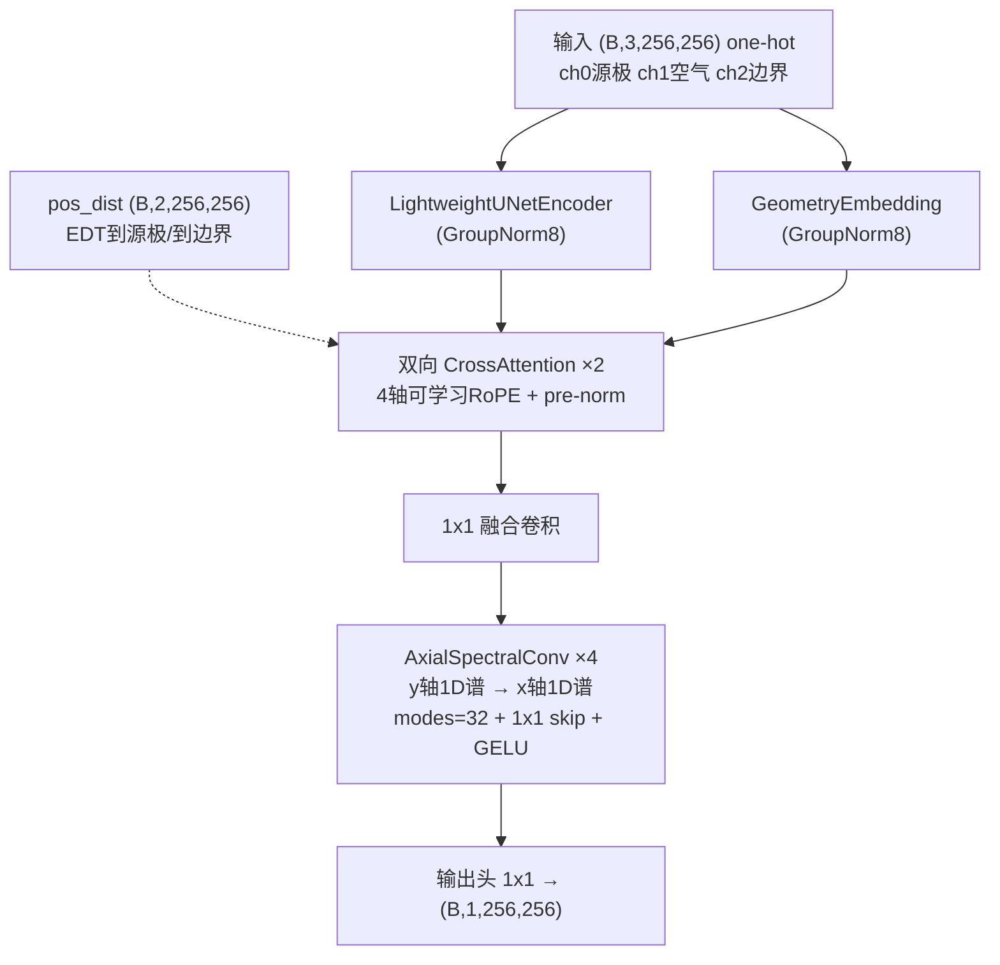

# 阶段一总结：Attention-PINN 模型架构改进

阶段一围绕用户提出的六项改进思路，完成了 **数据实测 → 方案裁决 → 全量重写 → 逐项验证** 的闭环。规格文档见 [[spec-improve-model-architecture]]（`.trae/specs/improve-model-architecture/`），全部 6 个 Task 完成并通过 12 项统一验证。

---

## 一、数据实测：推翻了三个先验假设

> [!danger] 关键实测发现（全量 1314 对扫描）
> 1. **电位全局 max = 60000**，原 `norm_factor=20000` 是**偏小**（归一化目标越界到 3.0）而非偏大 → 落定 **60000**
> 2. **边界(值3)电位恒 60000V、源极(值1)电位恒 0V** —— 与直觉命名相反：源极是接地极，边界是高压极
> 3. **源极全是 ≤2px 细条带**（腐蚀后无内点），**边界是厚导体**（内点 1350 px/样本）→ 直接决定了 loss_eq 的约束域设计

其余：区域图唯一值全集 $\{0,1,2,3\}$（值 0 罕见 ~2%）；源极严格等位（极差 < 1V 全成立）。

---

## 二、六项思路的最终裁决

| # | 思路 | 裁决 | 落地方式 |
|---|---|---|---|
| 1 | 可学习频率 RoPE | 采纳并加固 | 4 轴 RoPE + log-频率参数化 + 几何初始化 |
| 2 | 水波纹因果掩码 | **否决内核、动机融入 #1** | 椭圆方程无因果序；距离作为 RoPE 位置轴承接局部性先验 |
| 3 | 谱卷积参数过大 | 重构 | dense modes² → 轴向 1D 谱卷积 ×2 |
| 4 | BC/源极约束缺失 | 采纳 | loss_bc + loss_eq；附带修正归一化与损失尺度 |
| 5 | 差分后掩码伪梯度 | 采纳 | 十字腐蚀内点掩码先行 |
| 6 | BatchNorm 噪声 | 采纳 | GroupNorm(8) + 梯度累积 |

> [!warning] 为什么否决因果掩码（第二轮评审结论）
> 静电场满足 Laplace 方程 $\nabla^2\phi = 0$，属**椭圆型**方程——解在每一点同时依赖全部边界，不存在"由近及远"的信息传播时序。硬因果序只对波动（双曲）方程物理成立。
> **但"近处比远处重要"的局部性动机是对的** → 以软先验（RoPE 距离轴）而非硬信息流约束实现。

---

## 三、新架构总览

### 3.1 四轴可学习频率 RoPE（R1）

位置轴 = **y 坐标、x 坐标、到源极距离、到边界距离**（距离由 `distance_transform_edt` 在未填充图上计算，像素单位，与坐标轴同单位制）。

- head_dim=16 拆 4 轴各 4 维（2 频率对/轴），`rope_log_freqs (4,2)`，每 block 每轴独立
- 频率 $\theta = e^{\lambda}$，初始化波长 $\{224, 28\}$ px（覆盖 4–256px 尺度谱）
- Q 全分辨率坐标；K 池化格心坐标 $(idx+0.5)\times 16$，距离轴同步 `adaptive_avg_pool2d`
- 16 个频率值全程写入 TensorBoard，可监控塌缩

### 3.2 轴向谱卷积（R2）

dense `SpectralConv2d(in,out,modes,modes)` → 串联两级 1D 谱卷积（y 后 x），**每级都带完整通道混合**（避免秩 1 可分离核）：

$$\text{params}: \; 2 \times C^2 \times \text{modes} \times 2 \;=\; 131{,}072 \;/\text{块}$$

### 3.3 参数量对比

| | 旧模型 | 新模型 |
|---|---|---|
| 总参数 | 4,359,105 (4.36M) | **689,105 (0.689M)** ↓84% |
| 谱卷积占比 | 96.3% (modes=16) | 76.1% (modes=**32**) |
| 频率覆盖 | 16 模态 | **32 模态**（翻倍） |

> [!success] 降参数的同时升频率分辨率——破除了 dense modes² 的奢侈增长方式

---

## 四、损失体系（R3/R4/R5）

总损失：

$$\mathcal{L} = \mathcal{L}_d + \lambda_{phy}\,\mathcal{L}_p + \lambda_{grad}\,\mathcal{L}_g + \lambda_{bc}\,\mathcal{L}_{bc} + \lambda_{eq}\,\mathcal{L}_{eq}$$

默认 $\lambda = (1.0,\; 0.1,\; 2.0,\; 5.0)$，全部 CLI 可调。

| 项 | 定义 | 约束域 |
|---|---|---|
| $\mathcal{L}_d$ | masked MSE | 有效区 |
| $\mathcal{L}_p$ | $\text{mean}\,((\nabla^2\phi \cdot H^2)^2)$ | **空气区十字内点**（Laplace 残差） |
| $\mathcal{L}_g$ | $H^2\,\text{mean}\,((\nabla\phi - \nabla\phi_{tgt})^2)$ | 有效区十字内点 |
| $\mathcal{L}_{bc}$ | Dirichlet MSE | 源极∪边界（目标恒 0/1.0） |
| $\mathcal{L}_{eq}$ | $H^2\,\text{mean}\,((\nabla\phi)^2)$ | **导体（源极∪边界）内点**（E=0） |

> [!tip] 两个关键设计修正（实现期发现）
> - **十字腐蚀而非 3×3 盒式**：与 `torch.gradient` 中心差分模板严格一致；注意"垂直+水平 min-pool 复合"数学上等价 3×3 盒式（经典陷阱），正确写法是两个方向腐蚀的 `torch.minimum`
> - **loss_eq 约束域从"源极"扩为"导体"**：实测源极细条带腐蚀后无内点（原设计恒空转），而边界厚导体内点 1350 px——E=0 对任何导体成立，扩域后该项真正生效

**无量纲化**：物理损失乘 $H$ 或 $H^2$（$H=256$ 网格高）消除逐像素差分的固有尺度因子，与 `norm_factor` 解耦，λ 语义稳定。这也是对"原实现物理损失近零"根源的修正——真凶是 $1/H^2$ 尺度因子而非归一化系数。

---

## 五、验证结果

> [!success] 全部通过
> - **玩具单元**：伪梯度对比 旧 14.125 → 新 < 1e-10（腐蚀内点消除填充边缘伪梯度）
> - **冒烟训练**（CPU，2 epochs × 4 样本）：总损失 29.1 → 19.1，五路损失有限无 NaN，loss_eq > 0（边界内点贡献），loss_bc ≈ 0.59
> - **统一验证 12 项全 PASS**：BatchNorm=0、参数 689,105、RoPE 独立 (4,2)、频率初值 $2\pi/\{224,28\}$、forward 双路径、无 NaN、十字腐蚀判别、五路损失有限、loss_bc 量级、loss_eq>0、旧权重未动、新权重生成
> - **可视化**：六联图 1800×1000 正常渲染
> - 旧 `dual_encoder_fno_model.pth` 原样保留，新权重写 `dual_encoder_fno_model_v2.pth`

---

## 六、阶段二展望

- [ ] **全量数据训练**：当前仅冒烟（4 样本）；1314 对样本跨 100 工况，需划分训练/验证集，观察 RoPE 频率分化
- [ ] **λ 扫描**：五个损失权重的消融（尤其 $\lambda_{bc}$ 与 $\lambda_{eq}$ 的边际价值）
- [ ] **modes/width 消融**：轴向谱卷积的频率覆盖 vs 参数预算
- [ ] **频率塌缩监控**：若多轴 λ 收敛到同值，考虑加正则
- [ ] **评估指标**：相对 L2 误差、边界条件违反度、Laplace 残差的空间分布
- [ ] **潜在方向**：[[阶段二-数据利用率]]、[[阶段二-RoPE频率分析]]

---

## 附：文件索引

| 文件 | 变更 |
|---|---|
| `Attentiion_PINN/dataset.py` | norm_factor=60000、EDT 距离辅助、4 元组返回 |
| `Attentiion_PINN/model.py` | CrossAttentionBlock 重写（4 轴 RoPE）、AxialSpectralConv、GroupNorm |
| `Attentiion_PINN/train.py` | 五路损失、十字腐蚀、argparse、梯度累积、RoPE 日志 |
| `Attentiion_PINN/visualize.py` | CLI 化、4 元组、误差图口径对齐 |
| `.trae/specs/improve-model-architecture/spec.md` | 规格与裁决记录 |
| `.trae/specs/improve-model-architecture/checklist.md` | 逐项验证记录（全勾） |

#2D-EMF #PINN
