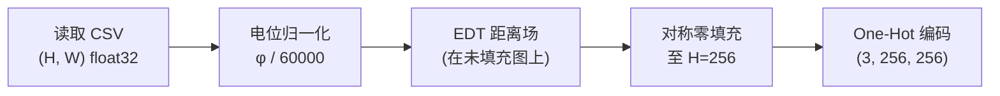
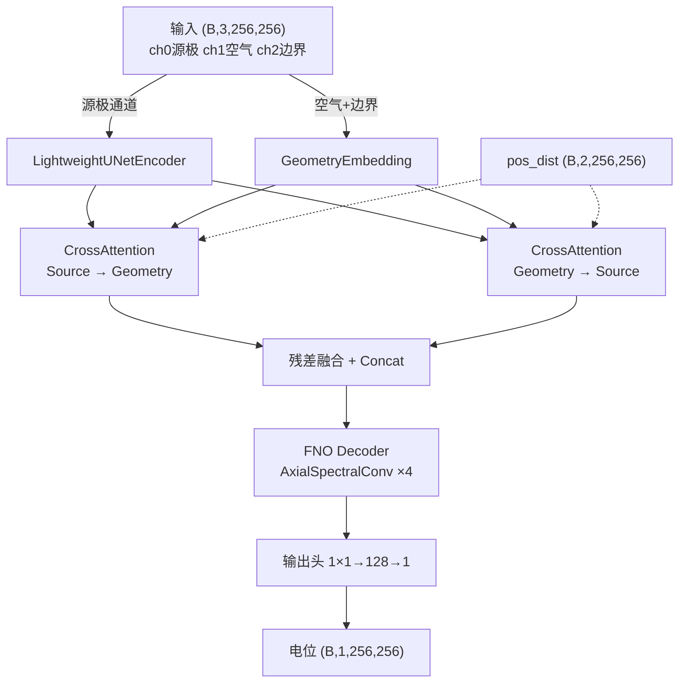

# 模型基础实现：DualEncoderFNODecoder

本文档记录 2D 静电场（EMF）预测任务的**基础模型架构**与数据管线，是后续一切改进的基准。实现位于 [[Attentiion_PINN]] 目录：[dataset.py](file:///workspace/Attentiion_PINN/dataset.py)、[model.py](file:///workspace/Attentiion_PINN/model.py)、[train.py](file:///workspace/Attentiion_PINN/train.py)。

---

## 一、任务定义

输入：二维区域图（几何材质分布），输出：该几何下的静电电位分布 $\phi(x, y)$。

- **输入**：区域图，每个像素取离散值 $\{0, 1, 2, 3\}$
  - `0` = 填充区（无效，原始数据零填充产生）
  - `1` = 源极（接地极，电位恒 0V）
  - `2` = 空气（求解域，满足 Laplace 方程 $\nabla^2 \phi = 0$）
  - `3` = 边界（高压极，电位恒 60000V）
- **输出**：连续电位场 $\phi \in [0, 60000]\text{V}$
- **物理背景**：静电平衡下，空气域无自由电荷，电位满足 Laplace 方程；导体内部电场为零（等位体）

> [!note] 命名与直觉相反
> 实测数据显示「源极」接地（0V），「边界」为高压极（60000V）。命名沿用原始数据集约定。

---

## 二、数据管线（dataset.py）

### 2.1 文件配对

目录下 `original_region_data_*.csv` 与 `potential_distribution_*.csv` 按后缀配对，后缀编码工况与几何尺寸。

### 2.2 预处理流程



**关键步骤**：

1. **电位归一化**：`target / 60000.0`，将 $\phi$ 映射到 $[0, 1]$。`norm_factor=60000` 来自全量 1314 对扫描的全局最大值。
2. **EDT 距离场**（位置辅助，不进输入通道）：
   - `dist_to_source = distance_transform_edt(region != 1)` → 到最近源极像素的欧氏距离
   - `dist_to_boundary = distance_transform_edt(region != 3)` → 到最近边界像素的欧氏距离
   - 在**未填充原图**上计算，再与主数据用相同方案零填充，保证距离轴与 y/x 坐标同量纲（像素）
3. **对称零填充**：高度不足 256 时上下均匀补零，同步生成有效性掩码 `mask`（1=有效，0=填充）
4. **One-Hot 编码**：3 通道（源极、空气、边界），填充区全零

### 2.3 输出格式

`__getitem__` 返回 4 元组：

| 元素 | 形状 | 含义 |
|---|---|---|
| `input_tensor` | `(3, 256, 256)` | One-Hot 几何图 |
| `target_tensor` | `(1, 256, 256)` | 归一化电位目标 |
| `mask_tensor` | `(1, 256, 256)` | 有效区掩码 |
| `pos_dist_tensor` | `(2, 256, 256)` | EDT 距离场（源极、边界） |

---

## 三、模型架构（model.py）

整体结构：**双编码器 → 双向交叉注意力 → 融合 → FNO 解码器 → 输出头**



### 3.1 源极编码器：LightweightUNetEncoder

轻量 U-Net，仅处理源极单通道：

```
inc:  Conv2d(1→C, 3, pad=1) → GroupNorm(8) → GELU
down1: Conv2d(C→2C, 3, stride=2, pad=1) → GroupNorm → GELU
down2: Conv2d(2C→4C, 3, stride=2, pad=1) → GroupNorm → GELU
up1:   ConvTranspose2d(4C→2C, 2, stride=2)  + skip(down1)
up2:   ConvTranspose2d(2C→C, 2, stride=2)   + skip(inc)
out:   Conv2d(C→C, 1)
```

输出与输入同分辨率 `(B, C, H, W)`，`C = width = 32`。

### 3.2 几何编码器：GeometryEmbedding

处理空气+边界双通道，用 1×1 卷积做逐像素嵌入 + 3×3 卷积做空间混合：

```
embedding: Conv2d(2→C, 1) → GELU → Conv2d(C→C, 1) → GELU
spatial_mix: Conv2d(C→C, 3, pad=1) → GroupNorm(8) → GELU
```

### 3.3 双向交叉注意力：CrossAttentionBlock

两组对称模块，让源极特征与几何特征互相查询：

- **s2g**：Source 查询 Geometry（`attn_s = cross_attn_s2g(feat_s, feat_g)`）
- **g2s**：Geometry 查询 Source（`attn_g = cross_attn_g2s(feat_g, feat_s)`）

核心设计：

| 组件 | 说明 |
|---|---|
| Q/K/V 投影 | 1×1 卷积，`dim = width = 32` |
| 多头 | `num_heads=2`，`head_dim=16` |
| K/V 下采样 | `adaptive_avg_pool2d` 16×16 倍，降低显存 |
| Pre-norm | `PixelLayerNorm`（逐像素通道 LayerNorm）作用于 Q 与 K/V |
| RoPE | 4 轴可学习频率位置编码（见 [[阶段一改进记录]] 的 R1 节） |

融合方式：残差连接后拼接，再 1×1 卷积压缩回 `width` 通道：

$$\text{fused} = \text{Conv}_{1\times1}\big([\text{feat}_s + \text{attn}_s,\; \text{feat}_g + \text{attn}_g]\big)$$

### 3.4 FNO 解码器：AxialSpectralConv ×4

4 个谱卷积块串联，每块结构为 **谱卷积 + 1×1 skip + GELU**（最后一块无 GELU）：

```
x1 = fno_i(x)
x2 = w_i(x)           # 1×1 skip
x = GELU(x1 + x2)
```

`AxialSpectralConv` 用两级 1D 谱卷积替代 dense 2D 谱卷积（沿 y 轴后沿 x 轴），大幅减少参数：

- Stage 1：`rfft(x, dim=-2)` → 通道混合 `einsum` → `irfft`（y 轴 1D 谱卷积）
- Stage 2：同上沿 `dim=-1`（x 轴 1D 谱卷积）

参数：$2 \times C^2 \times \text{modes} \times 2$，每块约 131K 参数（`C=32, modes=32`）。

### 3.5 输出头

```
Conv2d(C→128, 1) → GELU → Conv2d(128→1, 1)
```

输出 `(B, 1, 256, 256)`，值域 $[0, 1]$（经训练约束）。

---

## 四、训练循环（train.py）

### 4.1 超参（默认值）

| 参数 | 值 |
|---|---|
| epochs | 50 |
| batch_size | 2 |
| lr | 1e-3 |
| weight_decay | 1e-5 |
| modes | 32 |
| width | 32 |
| 设备 | CUDA 优先，否则 CPU |

### 4.2 损失函数

五路损失加权求和（详见 [[阶段一改进记录]] 第四节）：

$$\mathcal{L} = \mathcal{L}_d + \lambda_{phy}\mathcal{L}_p + \lambda_{grad}\mathcal{L}_g + \lambda_{bc}\mathcal{L}_{bc} + \lambda_{eq}\mathcal{L}_{eq}$$

| 项 | 默认 λ | 物理含义 |
|---|---|---|
| $\mathcal{L}_d$ | — | 数据 MSE（masked） |
| $\mathcal{L}_p$ | 1.0 | Laplace 残差（空气区内点） |
| $\mathcal{L}_g$ | 0.1 | 梯度场匹配 |
| $\mathcal{L}_{bc}$ | 2.0 | Dirichlet 边界条件（源极+边界） |
| $\mathcal{L}_{eq}$ | 5.0 | 导体等位约束（$\|\nabla\phi\|^2=0$） |

### 4.3 训练特性

- **梯度累积**：`--grad-accum N`，在小 batch 下扩大有效 batch
- **AMP**：CUDA 自动混合精度，谱卷积内部禁用 autocast 避免 ComplexHalf
- **TensorBoard**：五路损失分项 + 16 个 RoPE 频率值全程记录
- **权重保存**：`dual_encoder_fno_model_v2.pth`（不覆盖旧权重）

---

## 五、参数量

| 模块 | 参数量 |
|---|---|
| LightweightUNetEncoder | ~30K |
| GeometryEmbedding | ~5K |
| CrossAttentionBlock ×2 | ~45K |
| AxialSpectralConv ×4 | 524K（每块 131K） |
| 输出头 | ~4.5K |
| **总计** | **689,105（0.689M）** |

---

## 附：文件索引

| 文件 | 职责 |
|---|---|
| [dataset.py](file:///workspace/Attentiion_PINN/dataset.py) | 数据加载、归一化、EDT 距离、One-Hot、填充 |
| [model.py](file:///workspace/Attentiion_PINN/model.py) | 双编码器、交叉注意力、谱卷积、输出头 |
| [train.py](file:///workspace/Attentiion_PINN/train.py) | 五路损失、训练循环、CLI、TensorBoard |
| [visualize.py](file:///workspace/Attentiion_PINN/visualize.py) | 推理与六联图可视化 |

#2D-EMF #PINN #FNO
