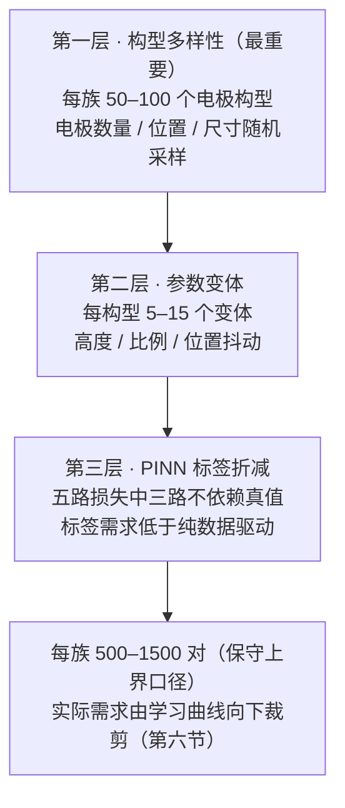
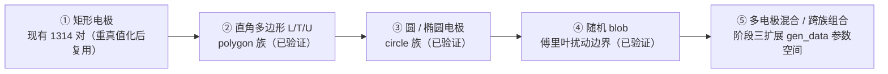

# 数据量讨论与不规则区域拓展

本文档是阶段二 Spec R9 交付物，回答用户三问：**每个几何形状需要多少数据、如何拓展到复杂不规则区域、当前 1314 对是否合理/足够**。模型背景见 [[1. 模型基础实现]] 与 [[2. 阶段一改进记录]]，阶段二工程交付（递归加载 / 划分 / 指标 / 生成器 / 校验器）见 [[4. 阶段二记录]]。

> [!question] 三个问题，三个一句话答案（详论见正文）
> 1. **每族多少数据**：50–100 构型 × 5–15 变体 = **500–1500 对/族**（保守上界口径，PINN 物理损失可向下折减）
> 2. **如何拓展不规则区域**：**模型侧零改动**（one-hot 输入 + EDT 距离轴 + 区域语义物理损失天然几何无关），生成侧按"分形课程"四族推进
> 3. **当前 1314 对**：**数量接近够（矩形族预计饱和）、质量必须修（R6 裁决 FAIL，真值中位约 12% 偏差）、族多样性全空白（圆/多边形/blob 三族 0 对）**

> [!info] 本文数字来源（事实纪律）
> - Spec `implement-phase2-data-eval`：「数据量讨论」章节与 R6 裁决 callout
> - `Attentiion_PINN/verification_report.json`：1314 对全量交叉校验统计
> - `data/{rect,circle,polygon,blob}/gen_report.json`：四族参数空间与一次性验证批（每族 2 构型 × 2 变体）实测耗时
> - 2026-10-01 数据勘察统计（约 100 工况目录实测）
> - 所有外推值均标注"约/预计"并注明推断依据；学习曲线训练实验为阶段三执行（本阶段仅交付设计，第六节）

---

## 一、问题与背景

### 1.1 模型与监督方式——决定数据需求的两个"自变量"

阶段一重构后的模型（[[2. 阶段一改进记录]]）：双编码器 + 双向交叉注意力（4 轴可学习 RoPE：y、x、到源极 EDT 距离、到边界 EDT 距离）+ 轴向谱卷积 FNO 解码器，**总参数 689,105（0.689M，自 4.36M 压缩 84%）**。监督采用五路损失：

$$
\mathcal{L} = \mathcal{L}_d + \lambda_{phy}\,\mathcal{L}_p + \lambda_{grad}\,\mathcal{L}_g + \lambda_{bc}\,\mathcal{L}_{bc} + \lambda_{eq}\,\mathcal{L}_{eq},\qquad \lambda = (1.0,\;0.1,\;2.0,\;5.0)
$$

| 损失项 | 定义 | 约束域 | 依赖真值？ |
|---|---|---|---|
| $\mathcal{L}_d$ | masked MSE | 有效区 | 是（唯一"看答案"的主项） |
| $\mathcal{L}_g$ | $H^2\,\mathrm{mean}\,((\nabla\phi-\nabla\phi_{tgt})^2)$ | 有效区十字内点 | 是（梯度场匹配） |
| $\mathcal{L}_p$ | $\mathrm{mean}\,((\nabla^2\phi\cdot H^2)^2)$ | 空气区十字内点 | 否（Laplace 残差，纯物理） |
| $\mathcal{L}_{bc}$ | Dirichlet MSE | 源极∪边界 | 否（目标恒 0/1 常数） |
| $\mathcal{L}_{eq}$ | $H^2\,\mathrm{mean}\,((\nabla\phi)^2)$ | 导体（源极∪边界）内点 | 否（导体 E=0） |

**五路中三路不依赖真值**——这是第三节"PINN 标签折减"的直接依据，也是第四节"真值偏差可被部分抵御"的缓解因素。模型小（0.689M）+ 物理监督占比高，意味着数据需求由**构型覆盖**而非参数量主导。

### 1.2 现有 1314 对的构成（2026-10-01 勘察实测）

| 维度 | 统计 |
|---|---|
| 总量 | **1314 对** ≈ 100 工况 × 11–14 个高度变体 |
| 宏族 | 单一"矩形宏族"：外框源极（1px 环，0V）+ **1–10 个实心矩形 HV 电极**（60000V） |
| 构型维（工况目录） | 电极数量/位置布局；源极连通域：1 域 64 工况、2 域 20、3 域 15（含内部源极条带） |
| 变体维（文件后缀） | 区域高度 256→166 步进 −10（宽度恒 256），个别含 50 |
| 特例 | 3 个工况（13/15/16）HV 电极含闭合空腔；**boundary14 仅 1 对**；boundary21 有 35 对（含 21 个 50×50 小图，其 0 值像素为 0V 接地电极语义，见 4.2） |
| 适定性 | 空气被 Dirichlet 边界完全包裹（air 触边 = 0 全库成立）→ 无 Neumann 歧义 |

> [!tip] 关键观察：1314 对全部属于同一个宏族
> 无论总量多大，"矩形电极 + 外框源极"之外的世界（圆、多边形、任意曲线边界）覆盖为**零**。这是第四节数量裁决与第五节拓展路线的共同出发点。

---

## 二、三层框架：需要多少数据



**第一层：构型多样性（最重要）。** 电场形态主要由**电极数量与位置**决定——高度变体只是同一几何的 1 维连续形变，场解高度相似；而"3 个粗电极"与"10 个细电极"的场拓扑完全不同。**多样性瓶颈在构型数而非总对数**。建议每几何族 ≥50–100 个电极构型（数量、位置、尺寸随机采样）。

**第二层：参数变体。** 每构型 5–15 个变体（高度/比例/位置抖动），作用是让模型学到同构型下的连续形变规律。现有数据的 11–14 个高度变体即此层；`gen_data.py` 的高度池为 [256, 246, …, 166] 共 10 档（variant0 = 256 + 无放回抽样）。

**第三层：PINN 标签折减。** 纯数据驱动的密集回归需要每个像素都有可靠标签；本文模型的 $\mathcal{L}_p$（Laplace 残差）、$\mathcal{L}_{bc}$（Dirichlet 常数目标）、$\mathcal{L}_{eq}$（导体 E=0）三路**只需区域图本身**（即输入），不需真值场。因此标签需求低于纯数据驱动——500–1500 对/族应理解为**保守上界**，实际需求由阶段三学习曲线向下裁剪（无标签几何的半监督预训练在 Spec 中列为阶段三展望项）。

---

## 三、每几何形状样本量建议与生成成本

### 3.1 四族参数空间与生成成本（gen_report.json 实测）

`gen_data.py` 已按 R7/R8 完成四族一次性验证批（每族 2 构型 × 2 变体 = 4 对，五关校验全过，**不产出完整数据集**——完整生成按本节数量推迟阶段三执行）：

| 族 | 电极参数空间（已验证） | 验证批实测 | 外推 500 对 | 外推 1500 对 |
|---|---|---|---|---|
| rect 矩形 | 1–10 个实心矩形，边长 16–110px 均匀随机；电极间/对外框 ≥8px 空气隙 | 2.3 s / 4 对（0.58 s/对） | 约 5 分钟 | 约 14 分钟 |
| circle 圆/椭圆 | 1–6 个实心圆/椭圆，半轴 10–52px（行/列方向独立采样） | 3.4 s / 4 对（0.85 s/对） | 约 7 分钟 | 约 21 分钟 |
| polygon 多边形 | 1–4 个直角多边形（L/T/U 模板：臂厚 10–22px、主长 36–84px、横臂 24–84px、U 开口 12–30px；整体旋转 0/90/180/270°） | 5.5 s / 4 对（1.38 s/对） | 约 12 分钟 | 约 35 分钟 |
| blob 不规则 | 1–3 个傅里叶扰动 blob（公式见 5.2） | 4.7 s / 4 对（1.18 s/对） | 约 10 分钟 | 约 30 分钟 |

- **合计 16 对 15.9 秒（约 16 秒，CPU），平均约 1 秒/对 → 每族 1000 对约 17 分钟**（按平均速率线性外推）
- 磁盘：验证批实测约 0.7 MB/对（每族 2.78–2.93 MB / 4 对）→ 1000 对约 0.7 GB
- 质量保障：落盘前五关校验（BC 精确 mem+roundtrip / 导体 E=0 / 求解残差 <1e-10，实测约 2e-15 / 存储 Laplace <0.05V，实测 ≤0.015V / 细网格抽检 rel L2 <0.02，实测 0.0043–0.0056），失败拒写盘

> [!note] 外推口径说明
> 耗时与磁盘均为 4 对验证批实测后线性外推。验证批含每构型 1 次细网格抽检（refine_check_ratio 0.25），变体数增大后该项按构型摊薄，批量生成**预计更快**；密集电极布局的随机重试可能略增耗时，故按上界口径陈述。

### 3.2 每族样本量建议：精简与保守两档

| 档位 | 构型数/族 | 变体/构型 | 每族对数 | 四族合计 | 生成耗时（外推） | 磁盘（外推） |
|---|---|---|---|---|---|---|
| **精简档**（先行验证） | 50 | 10 | 500 | 2000 | 约 33 分钟 | 约 1.4 GB |
| **保守档**（上界准备） | 100 | 15 | 1500 | 6000 | 约 100 分钟 | 约 4.2 GB |

两个执行要点：

1. **rect 族无需新生成**：现有 1314 对 = 100 构型 × 11–14 变体，已在保守档区间内——只需阶段三"重真值化 + region 错标修复"（约 7 分钟，见 4.2）即可直接充当 rect 保守档。因此精简档实际只需新生成 circle/polygon/blob 三族 1500 对（约 30 分钟、约 1.1 GB）。
2. **保守档 15 变体/构型超出当前 10 档高度池**：需扩展变体维度（位置抖动/比例缩放，Spec 三层框架已预留"高度/比例/位置抖动"三种变体），属 `gen_data.py` 的参数扩展而非新管线。

> [!success] 结论：数据生成不是瓶颈，多样性设计才是
> 保守档全四族 6000 对也只需约 1.7 小时 CPU、约 4.2 GB 磁盘；实际（rect 复用）约 85 分钟。瓶颈不在"生成得起多少"，而在**构型空间怎么设计覆盖**（电极数量/位置/尺寸的分布）与**真值质量是否可信**（第四节）。

---

## 四、当前 1314 对是否足够：量与质的两维裁决

### 4.1 量维：矩形宏族预计接近饱和

对照三层框架逐维检查：

| 维度 | 现有数据 | 建议区间 | 判定 |
|---|---|---|---|
| 构型数 | 100 工况 | 50–100 / 族 | 达到上沿 → 预计饱和 |
| 变体/构型 | 11–14（高度维） | 5–15 | 上段 → 预计饱和 |
| 总对数 | 1314 | 500–1500 / 族 | 上半段 |

Spec 判断：**当前 1314 对的矩形族预计已接近饱和（100 构型），最终裁决权在学习曲线**（第六节：样本翻倍后 val 相对 L2 改善 <10% 即确认饱和）。

两条分布长尾需留意（它们是"不均衡"而非"不够"）：

- **boundary14 仅 1 对**（该构型变体覆盖最薄，1/15）；**boundary21 有 35 对**（含 21 个 50×50 小图，超出 256→166 高度池的尺寸长尾——交叉校验证实其 0 值像素为 0V 接地电极，按接地语义求解 rel L2 约 1e-6，本身即本网格 FD 精确解）
- 若学习曲线显示小尺寸样本是误差主因，正确动作是**为 50×50 形态单独补构型**，而非全库加量

### 4.2 质维：R6 裁决 FAIL——真值必须重做

> [!danger] R6 裁决结果（2026-10-01，全量 1314 对 FD 交叉校验，verification_report.json）
> - **裁决：FAIL**。空气区相对 L2：mean 0.128 / p50 0.116 / p90 0.250 / max 0.431（阈值 1e-3，**1290/1314 对超标**，通过率仅 1.83%）；max 偏差 mean 5171V、max 22594V（约 38% Vmax）
> - **根因**：存储场是 5 点 FD 方程的**未完全收敛迭代解**——方程残差仅约 3.13V（相对 Vmax ≤2.1e-4；BC/E=0 全库精确，"物理口径合格"），但低频残差被 Laplace 逆算子放大（$\|e\|/\|r\| \approx 1761$）成千伏级场误差
> - **标注错误**：597 对 region 图把内部接地电极错标为空气（共 1,363,696 px）、35 对含隐藏 HV 错标（105 px）——对空气区解无影响，但输入标注有误
> - **对照实证**：独立 FD 精确解（spsolve，残差约 2e-15）与 21 对 boundary21/_50 存储场 rel L2 约 1e-6，证明"本网格 FD 精确解"可达，且生成侧已具备（`gen_data.py` 五关校验全过）

换言之：**用当前真值场做监督，模型最多拟合到"未收敛迭代解"**——中位约 12%（p50 = 0.116）的系统性标签偏差是数据问题而非模型问题。阶段三必做（Spec 已排期）：

1. **重真值化**：用 `verify_data.py` 同款 FD 精确解求解器替换 1314 对存储场，**约 7 分钟**（参照全量交叉校验实测 394.9 s ≈ 6.6 分钟外推）
2. **region 错标修复**：用 stored==0/60000 反推隐藏电极，修正 597+35 对
3. 缓解因素：五路损失中三路不依赖真值，可部分抵御真值偏差；但 $\mathcal{L}_d$、$\mathcal{L}_g$ 仍以真值为锚——重真值化后复训才能真正兑现物理损失的价值

### 4.3 综合裁决（回答问题 3）

> [!warning] 三句话结论
> - **量：接近够**——构型/变体两维均处建议区间上沿，矩形宏族预计饱和（学习曲线终裁）
> - **质：必须修**——R6 FAIL，真值场中位约 12% 偏差 + 632 对 region 错标；修复成本极低（约 7 分钟）
> - **广度：空白**——圆/多边形/blob 三族 0 对，**族多样性才是真正缺口**

---

## 五、如何拓展到复杂不规则区域

### 5.1 模型侧：无需任何改动

四点论证（详见 [[1. 模型基础实现]] 的架构与 [[2. 阶段一改进记录]] 的 R1）：

1. **输入表示几何无关**：模型输入是 one-hot 区域图（源极/空气/边界 3 通道）——任意形状电极只是这张图上的一个连通域，架构中不存在"矩形"假设
2. **EDT 距离轴几何无关**：4 轴 RoPE 中两个距离轴（到源极/到边界）由 `distance_transform_edt` 从布尔掩码计算，对任意闭合形状有定义；"离电极 30px"的物理语义在 blob 电极上同样成立
3. **物理损失只依赖区域语义**：$\mathcal{L}_p$ 约束空气区、$\mathcal{L}_{bc}$ 约束 Dirichlet 边界、$\mathcal{L}_{eq}$ 约束导体内点——约束域全部由 region 图给出，与边界形状解耦；FNO 谱卷积与交叉注意力作用在均匀网格上，同样形状无关
4. **适定性不变式**：唯一物理前提是空气域被 Dirichlet 边界完全包裹（全库实测成立）。生成器的外框源极环 + ≥8px 空气隙在四族上保持该性质；被导体完全隔离、不接触任何 Dirichlet 电极的空气连通域电位不定，需在生成器布局约束中规避（现有 1314 对实测 n_isolated_air = 0）

### 5.2 生成侧：分形课程（fractal curriculum）



课程设计逻辑：①→④ 每步只增加**边界曲率自由度**（直线直角 → 直线斜角/凹形 → 常曲率 → 变曲率），物理问题本身不变（同 Laplace 方程 + Dirichlet 边界），因此可混在同一数据集与同一模型中训练。blob 的参数化：

$$
r(\theta) = r_0\Big(1 + \sum_{k=2}^{5} a_k \cos(k\theta + \varphi_k)\Big),\qquad r_0 \in [18,44]\,\mathrm{px},\;\; |a_k| \le 0.25,\;\; \sum_k |a_k| \le 0.7
$$

幅度限幅 + 逐像素 $\rho \le r(\theta)$ 精确填充 → **星形域（star-shaped）构造上不自交**。四族均通过 R7 五关校验（3.1 节），第 ⑤ 步（如矩形 + blob 同场混合）是参数空间的自然扩展，阶段三按需增加模板即可。

混训策略建议（阶段三定案）：全族混训 + 按族采样的均衡权重，配合 group split 按族报告——一次训练同时拿到插值与外推两个口径。

### 5.3 风险与对策

| 风险 | 对策 | 现有支撑 |
|---|---|---|
| 训练分布外的极端形状（外推失效） | group split（按工况整组 80/20，val 与 train 工况零交集）单独报告外推误差，与 random split 的插值口径分开呈现 | R2 已实现 `--split-mode group` |
| 尖角/细颈几何的 FD 求解精度不足 | 生成时细网格抽检兜底：细网格解与粗网格解对比 rel L2 < 0.02 才允许落盘 | `gen_data.py` 内建第 5 关校验（refine_check_ratio 0.25） |
| blob 边界自交（非法几何） | 星形域构造：$\sum_k\|a_k\| \le 0.7$ 限幅 + 逐像素精确填充 | R8 验证批不自交抽检通过 |
| 尺寸长尾（如 50×50 小图）特殊语义 | 0 值像素 = 接地电极的语义已由交叉校验澄清；必要时作独立"小尺寸构型"补充 | boundary21/_50 共 21 对实证 |

---

## 六、阶段三学习曲线实验设计（数据量终裁）

> [!info] 定位与前置
> 学习曲线实验原属阶段二，按 2026-10-01 用户裁决移至阶段三（Spec REMOVED Requirements）；TensorBoard 管线（R4）已在阶段二以小规模冒烟验证可用。**前置依赖：1314 对重真值化 + region 修复先行**——否则学习曲线在拟合有偏真值，结论无效。

### 6.1 实验矩阵

- **数据**：rect 宏族 1314 对（重真值化后）
- **固定验证集**：`--split-mode random --val-ratio 0.2 --split-seed 42` → 训练 1051 / 验证 263；首个 run 落盘 manifest，后续全部 `--split-file` 复用 → **四次 run 的 val 恒为同一 263 对**
- **子集**：`--limit-samples` 取训练集前 N（前缀截断天然嵌套 263 ⊂ 526 ⊂ 788 ⊂ 1051，前提是同一 `--data-path` 加载顺序确定）
- **唯一变量是训练样本数**：epochs 50 / batch 2 / lr 1e-3 / λ 默认 (1.0, 0.1, 2.0, 5.0) / modes 32 / width 32，全 run 一致

| run 名 | 子集 | 训练样本 | 验证样本 |
|---|---|---|---|
| lc_rect_25p | 25% | 263 | 263（固定） |
| lc_rect_50p | 50% | 526 | 263（固定） |
| lc_rect_75p | 75% | 788 | 263（固定） |
| lc_rect_100p | 100% | 1051 | 263（固定） |

### 6.2 判据（边际收益法）

$$
\text{边际收益}(N) = \frac{E_{\text{val}}(N) - E_{\text{val}}(2N)}{E_{\text{val}}(N)},\qquad E_{\text{val}} = \text{val 相对 L2 } \big(\|\hat\phi-\phi^*\|_2 / \|\phi^*\|_2,\ \text{masked 口径}\big)
$$

- 样本翻倍后改善 **< 10%** → 判定该族该量级"够用"（饱和）
- **外推口径另评**：同一矩阵在 `--split-mode group` 下另跑一组——外推口径的饱和点通常晚于插值口径，两者分开报告才诚实
- 新族（circle/polygon/blob）精简档生成后复用同一矩阵，`--data-path` 换 `/workspace/data` 即可

### 6.3 执行命令（train.py / eval.py 现有 CLI）

```bash
# 前置（阶段三）：重真值化 + region 错标修复（约 7 分钟，见 4.2）

# Run 1：25% 子集；生成并落盘划分 manifest（默认写 <log-dir>/split_manifest.json）
# 注意 --save-dir 按 run 隔离（默认存脚本目录，四次 run 会互相覆盖权重）
python train.py \
  --data-path /workspace/retangle_data \
  --split-mode random --val-ratio 0.2 --split-seed 42 \
  --limit-samples 263 \
  --epochs 50 --batch-size 2 --lr 1e-3 \
  --save-dir runs/lc_rect_25p/weights \
  --run-name lc_rect_25p --log-dir runs/lc_rect_25p

# Run 2–4：--split-file 复用同一 manifest，只改 --limit-samples 与输出目录
python train.py --data-path /workspace/retangle_data \
  --split-file runs/lc_rect_25p/split_manifest.json \
  --limit-samples 526 --epochs 50 --batch-size 2 --lr 1e-3 \
  --save-dir runs/lc_rect_50p/weights \
  --run-name lc_rect_50p --log-dir runs/lc_rect_50p
# 75% 档：--limit-samples 788；100% 档：--limit-samples 0（全部 1051）

# 外推口径（另跑一组，val = 未见过的整工况）
python train.py --data-path /workspace/retangle_data \
  --split-mode group --val-ratio 0.2 --split-seed 42 \
  --epochs 50 --batch-size 2 --lr 1e-3 \
  --save-dir runs/lc_rect_group/weights \
  --run-name lc_rect_group --log-dir runs/lc_rect_group

# 训练后用 eval.py 出具同口径 JSON 报告（相对 L2 / max 误差 / BC 违反 / Laplace 残差 / 等位残差）
python eval.py --weights runs/lc_rect_100p/weights/dual_encoder_fno_model_v2.pth \
  --data-path /workspace/retangle_data \
  --split-file runs/lc_rect_25p/split_manifest.json \
  --out reports/eval_lc_rect_100p.json
```

> [!tip] 关于 --run-name（2026-10-01 更新：已合入主干）
> `--run-name` / `--tag`（连同 `--vis-interval` / `--vis-samples`）已随阶段二 Task 4（R4）落地 train.py 主干：run 名 + 全部超参 + 数据量 + 划分模式写入 hparams，TensorBoard 中各 run 同口径可比，本节命令可按原样执行。`--log-dir` 子目录隔离（manifest 默认写 `<log-dir>/split_manifest.json`）继续用于各 run 的日志与 manifest 隔离。

> [!tip] 曲线还能顺带诊断"质"
> 若重真值化后各档 val 相对 L2 整体大幅下移而曲线形状不变，则印证偏差是系统性标签问题而非模型容量问题——这正是第六节实验相对单纯调参的增量价值。

---

## 七、结论速览

| 用户问题 | 核心答案 | 主要依据 |
|---|---|---|
| 1. 每个几何形状多少数据？ | **50–100 构型 × 5–15 变体 = 500–1500 对/族**（保守上界）；PINN 三路物理损失不依赖真值，实际需求预计更低，由学习曲线向下裁剪。精简档 500 对/族先行，rect 族复用现有 1314 对 | 三层框架（Spec）+ 四族验证批实测成本 |
| 2. 如何拓展不规则区域？ | **模型侧零改动**（one-hot 输入、EDT 距离轴、区域语义物理损失均几何无关）；生成侧分形课程：矩形 → L/T/U 多边形 → 圆/椭圆 → blob 傅里叶扰动 → 多电极混合，四族已通过五关校验 | Spec 拓展路线 + R8 验证批 |
| 3. 当前 1314 对合理/足够？ | **数量接近够**（矩形族两维均处建议区间上沿，预计饱和）；**质量必须修**（R6 FAIL：真值中位约 12% 偏差、1290/1314 对超标，约 7 分钟可重真值化）；**族多样性全空白**（三族 0 对，是真正缺口） | R6 裁决 + 勘察统计 |

阶段三行动清单（按序执行）：

- [ ] 重真值化 1314 对 + 修复 597+35 对 region 错标（约 7 分钟）
- [ ] 生成 circle/polygon/blob 精简档（各 50 构型 × 10 变体 = 1500 对，约 30 分钟）
- [ ] 学习曲线 25/50/75/100%（random + group 双口径，第六节命令可直接执行）
- [ ] 视学习曲线结果升保守档或补尺寸长尾构型（50×50 形态）
- [ ] Spec 阶段三展望其余项：v2 全量训练、λ 扫描、modes/width 消融、物理损失半监督（无标签几何预训练）、EDT 距离轴消融

工程基础设施细节（R1 递归加载、R2 双口径划分、R3 指标、R7/R8 生成与校验）见 [[4. 阶段二记录]]。

#2D-EMF #PINN #数据集
