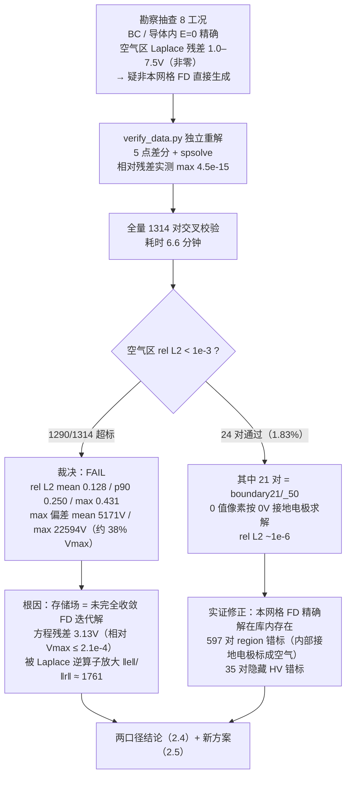
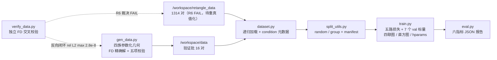

# 阶段二记录：数据生产管线、训练/验证划分与训练可视化

阶段二在阶段一架构重构（[[2. 阶段一改进记录]]：0.689M 参数 + 五路物理损失 + 4 轴可学习 RoPE，基础架构见 [[1. 模型基础实现]]）之上，补齐**数据与评估基础设施**：多工况递归加载、双口径划分、统一指标、TensorBoard 训练可视化、真值场独立校验与新数据生成管线。本阶段最重要的事件是 **R6 真值场裁决 FAIL** 及其直接引出的新生成方案（第二节）。

规格文档：`.trae/specs/implement-phase2-data-eval/`（spec + tasks，8 个 Task 全部完成）。数据量与不规则区域拓展的专题讨论见 [[3. 数据量讨论与不规则区域拓展]]。

> [!info] 本文数字来源（事实纪律）
> - `.trae/specs/implement-phase2-data-eval/tasks.md`：各 Task 完成记录与实测数字
> - `Attentiion_PINN/verification_report.json` / `.csv`：R6 全量 1314 对交叉校验统计
> - `data/{rect,circle,polygon,blob}/gen_report.json`：四族参数空间与验证批实测
> - `train.py` / `eval.py` / `verify_data.py` / `gen_data.py` 的 `--help`（CLI 全集实测）
> - 未经上述来源出现的数字均为外推，一律标注"约 / 预计"

---

## 一、阶段概览

### 1.1 阶段目标：闭合阶段一遗留的四个断层

| 断层 | 阶段二对策 | 落点 |
|---|---|---|
| ① 改进效果无量化证据（无系统评估指标） | 统一 masked 口径指标 + per-epoch 验证可视化 | R3 `eval_utils.py` / `eval.py`，R4 TensorBoard |
| ② `train.py` 只能读单工况目录（11–14 对），全量 1314 对无法加载、无划分 | 递归加载 + condition 元数据 + 双口径可复现划分 | R1 `dataset.py`，R2 `split_utils.py` |
| ③ 真值场生成方法未知、未经独立验证（用户要求"场一定要确保计算正确"） | 独立 FD 求解器全量交叉校验 → 裁决 FAIL → 新生成管线 | R6 `verify_data.py`，R7 `gen_data.py` |
| ④ 数据量是否足够、能否拓展到不规则区域没有答案 | 三层框架 + 两维裁决 + 分形课程讨论 | R9（[[3. 数据量讨论与不规则区域拓展]]） |

### 1.2 用户三项修订（2026-10-01，已写入 spec REMOVED Requirements）

> [!warning] 范围收缩：阶段二收敛为"基础设施 + 脚本 + 验证"
> 1. **抛弃 v1 基线复现**（原 R5）——旧权重 `dual_encoder_fno_model.pth` 原样保留，未来如需对比可从 state_dict 键名 / 形状反推架构
> 2. **数据生成收敛为"脚本 + 一次性验证运行"**（原 R7/R8 合并）——不产出完整数据集，完整生成推迟阶段三
> 3. **抛弃全量训练与学习曲线训练实验**——本阶段唯一训练类工作是 Task 4 的小规模冒烟；v2 全量训练与学习曲线推迟阶段三

### 1.3 八个任务完成表（全部 [x]）

| Task | 需求 | 交付物 | 关键实测 |
|---|---|---|---|
| 1 | R1 | `dataset.py` 递归加载 + condition 元数据（含环境重建：torch/tensorboard/matplotlib 重装） | 根目录 **1314 对 / 100 工况**；单工况路径回归不变 |
| 2 | R2 | `split_utils.py` + train.py 五个新 CLI | random **1051/263（20.02%）**、每工况 val≥1；group **20 个 val 工况零交集**；37/37 划分验证 PASS |
| 3 | R3 | `eval_utils.py` + `eval.py` | toy **27 项 PASS**（线性场 Laplace 残差 1.2e-12） |
| 4 | R4 | `train.py` TensorBoard 扩展 | 每 epoch **7 个 val 标量**、四联图、30 bins 直方图、**26 项 hparams**；冒烟约 5 分钟 |
| 5 | R6 | `verify_data.py` + 全量报告 | **裁决 FAIL**：rel L2 mean 0.128，1290/1314 超标（第二节） |
| 6 | R7+R8 | `gen_data.py` + 一次性验证批 | **16 对 / 16s** 五项校验全过；反向闭环 rel L2 max **2.8e-8** |
| 7 | R9 | [[3. 数据量讨论与不规则区域拓展]] | 三层框架 / 两维裁决 / 分形课程 / 学习曲线实验设计 |
| 8 | R10 | 本文档 | 阶段二记录 + 阶段三迁移安排（第六节） |

---

## 二、真值场验证与裁决（R6）

本阶段的核心事件。用户在阶段二开篇即要求"场一定要确保计算正确"，R6 的回答方式是：**用一个与数据生产完全无关的独立求解器，对全量数据重解一遍**。

### 2.1 验证方法

`verify_data.py` 内置独立 FD 求解器：

- **5 点差分**离散 Laplace 方程，Dirichlet 边界全封闭（空气被 0V/60000V 电极完全包裹，问题适定，全库实测无孤立空气域）
- **scipy 稀疏直接求解**（spsolve），要求相对残差 < 1e-10，**实测 max 4.5e-15**——独立解本身即"精确解"级别
- 对每对样本：以 region 图重建边界条件 → 独立求解 → 与存储场对比（空气区相对 L2、max 偏差、BC 精确性、导体内 E=0、存储场自身 Laplace 残差）
- 全量 1314 对耗时 **6.6 分钟**（394.9 s）；PASS 阈值：空气区 rel L2 < 1e-3

### 2.2 FAIL 证据链



> [!danger] R6 裁决（2026-10-01，全量 1314 对实测）：FAIL
> - **空气区 rel L2**：mean **0.128** / p50 0.116 / p90 **0.250** / max **0.431**——阈值 1e-3，**1290/1314 对超标**，通过率仅 1.83%
> - **max 偏差**：mean 5171V、max 22594V（约 38% Vmax）——不是噪声级偏差，是千伏级系统性失真
> - **BC / E=0 全库精确**：源极 0V、HV 60000V、0 值像素 0V 精确率均为 1.0，导体内 E=0 精确（物理口径合格，见 2.4）
> - 报告落盘：`verification_report.csv`（1314 行明细）+ `verification_report.json`（统计与归因）

### 2.3 根因：未收敛迭代解 + 椭圆方程的误差放大

存储场的**方程残差其实很小**——空气区离散 Laplace 残差全量均值仅 **3.13V**（相对 Vmax ≤ 2.1e-4）。但静电场求解是椭圆方程的"逆算子"问题：$e = L^{-1}r$，低频残差分量经逆算子后成为场误差，实测放大比

$$\frac{\|e\|}{\|r\|} \approx 1761$$

即 3.13V 的方程残差对应 mean 5171V 的场误差。结论：**存储场是 5 点 FD 方程的一个未完全收敛迭代解**。

> [!warning] 方法论教训：自洽残差不能替代独立验证
> 若只做"自洽性检查"（残差小、边界精确），这套数据会被误判为合格。椭圆问题的解误差 = 逆算子作用于残差，残差与误差之间隔着 ‖e‖/‖r‖≈1761 的放大系数。**真值证书只能由独立求解器交叉验证出具**——这正是 R6 从"抽查残差"升级为"全量独立重解"的原因，也是 `gen_data.py` 落盘前五项校验中必须含"细网格重解对比"的原因。

### 2.4 两口径结论

| 口径 | 检查内容 | 结论 |
|---|---|---|
| **物理口径**（自洽性） | BC 精确（源极 0V / HV 60000V / 0 值像素 0V）、导体内 E=0 | **合格**——存储场几乎满足方程与全部边界条件 |
| **数值口径**（真值正确性） | 与独立 FD 精确解对比，空气区 rel L2 < 1e-3 | **FAIL**——不可作为监督基准 |

裁决过程中的两条实证修正（避免把精度问题误诊为语义问题）：

1. **0 值像素 = 0V 接地电极**（非绝缘、非无效区）：boundary21/_50 的 21 对按接地语义求解后与存储场 rel L2 ~1e-6——既澄清了 50×50 小图的语义，也证明库内存在"本网格 FD 精确解"级别的样本（差异来自求解精度而非几何误读）
2. **region 图错标**：597 对把内部接地电极错标为空气（共 1,363,696 px）、35 对含隐藏 HV 错标（105 px）——对空气区解无影响，但输入标注有误，需阶段三修复

### 2.5 新方案（FAIL 的直接产物）

1. **生成侧（已落地，R7）**：`gen_data.py` 直接用本任务已验证的 FD 精确解求解器生成真值 + 落盘前五项自动校验（见 3.5）——新数据从源头免疫"未收敛"问题
2. **存量侧（推迟阶段三）**：1314 对"重真值化"（FD 精确解替换存储场，约 7 分钟）+ region 错标修复（用 stored==0/60000 反推）
3. **训练侧缓解**：五路损失中三路（$\mathcal{L}_p$ / $\mathcal{L}_{bc}$ / $\mathcal{L}_{eq}$）不依赖真值（明细见 [[3. 数据量讨论与不规则区域拓展]] 1.1 节），可部分抵御真值偏差；但 $\mathcal{L}_d$ / $\mathcal{L}_g$ 仍以真值为锚——重真值化后复训才能真正兑现物理损失的价值

---

## 三、交付管线与脚本说明



### 3.1 dataset.py（R1：多工况递归加载）

- **递归发现**：`--data-path` 指向数据根目录时递归 glob `**/original_region_data_*.csv` 并与 `potential_distribution_*.csv` 配对；指向单工况目录时行为与阶段一完全一致（回归验证通过，跨模式 `torch.equal` 一致）
- **condition 元数据**：每对样本附工况目录名，暴露 `self.conditions` / `condition_counts` / `get_condition()`——R2 分层划分与按工况统计的基础
- **实测**：根目录模式 **1314 对 / 100 工况**
- **附带修复**：宽度对称填充——boundary21 的 50×50 样本宽高均小于 256，跨工况组 batch 必需（group 模式全库训练的前提）

```bash
# 根目录全量加载（1314 对 / 100 工况）
python train.py --data-path /workspace/retangle_data ...

# 旧单工况路径，行为与阶段一一致
python train.py --data-path /workspace/retangle_data/results_reduction_fixed_boundary2 ...
```

### 3.2 split_utils.py（R2：双口径划分）

| 模式 | 语义 | 全量实测 |
|---|---|---|
| `random`（默认） | 按样本 80/20，按 condition 分层 | train **1051** / val **263**（20.02%），每工况 val ≥ 1 |
| `group` | 按工况整组 80/20 | **20 个 val 工况**，与 train 工况零交集（未见构型外推口径） |

- **可复现**：同 `--split-seed` 逐索引复现一致（37/37 验证 PASS）
- **manifest JSON**：seed / 模式 / train/val 文件清单 / condition 标注，`--split-out` 落盘、`--split-file` 加载——多次实验冻结同一验证集的机制

```bash
# random 分层划分并落盘 manifest
python train.py --data-path /workspace/retangle_data \
  --split-mode random --val-ratio 0.2 --split-seed 42 \
  --split-out runs/ph2/split_manifest.json

# group 外推口径
python train.py --data-path /workspace/retangle_data --split-mode group --val-ratio 0.2

# 复用既有 manifest（验证集冻结）
python train.py --data-path /workspace/retangle_data --split-file runs/ph2/split_manifest.json
```

train.py 新增 CLI（R2 部分）：`--val-ratio`、`--split-mode {random,group}`、`--split-seed`、`--split-file`、`--split-out`（默认 `<log-dir>/split_manifest.json`）。

### 3.3 eval_utils.py + eval.py（R3：统一指标）

指标全部为 **masked 口径**，与训练侧十字腐蚀掩码严格一致：

| 函数 | 定义 |
|---|---|
| `relative_l2` | $\|\phi-\phi^*\|_2 / \|\phi^*\|_2$（masked） |
| `max_abs_error` | masked $\max\|\phi-\phi^*\|$ |
| `bc_violation` | 源极∪边界处 $\max\|\phi-\phi^*\|$（Dirichlet 违反度） |
| `laplace_residual` | 空气区十字内点 $\mathrm{mean}\,\|\nabla^2\phi\cdot H^2\|$ |
| `equipotential_residual` | 导体内点 $\mathrm{mean}\,\|\nabla\phi\|\cdot H$（等位性） |
| `compute_all_metrics` | 一次调用返回全套 |
| `erode_mask` | 十字腐蚀内点掩码**单一来源**——train.py 验证循环与 eval.py 共用（Task 4 起统一），杜绝训练 / 评估口径漂移 |

toy 验证 **27 项 PASS**：线性场（$\nabla^2\phi=0$）laplace_residual = **1.2e-12**；pred = target 时全部指标 = 0；常数场等位残差 = 0；全零 mask 无 NaN。

```bash
# 加载权重，对任意数据目录 / 划分出具 JSON 报告（实测：六指标 + JSON）
python eval.py --weights dual_encoder_fno_model_v2.pth \
  --data-path /workspace/retangle_data \
  --split-file runs/ph2/split_manifest.json \
  --out reports/eval_ph2.json
```

eval.py CLI：`--weights`（必填）、`--data-path`（单工况或根目录，与 train.py 同语义）、`--split-file`（评估 val 子集）、`--limit`、`--batch-size`、`--model-type {v2}`、`--modes`、`--width`、`--norm-factor`、`--out`。

### 3.4 verify_data.py（R6：独立校验器）

```bash
# 全量交叉校验（1314 对，6.6 分钟）→ verification_report.csv / .json
python verify_data.py --data-root /workspace/retangle_data --out-dir .

# 调试 / 抽样
python verify_data.py --data-root /workspace/retangle_data --limit 50

# 对新生成数据反向校验（闭环，见 3.5）
python verify_data.py --data-root /workspace/data
```

CLI：`--data-root`、`--out-dir`、`--limit`、`--rel-l2-threshold`（默认 1e-3）、`--sample-per-dir`（每工况抽样 N 对，超时降级方案）。

### 3.5 gen_data.py（R7+R8：自动生成管线）

四族参数化几何（参数空间实测详见 [[3. 数据量讨论与不规则区域拓展]] 3.1 节）：

| 族 | 电极几何（已验证参数空间） |
|---|---|
| `rect` | 1–10 个实心矩形，边长 16–110px，电极间 / 对外框空气隙 ≥8px |
| `circle` | 1–6 个实心圆 / 椭圆，半轴 10–52px |
| `polygon` | 1–4 个直角多边形（L/T/U 模板，整体旋转 0/90/180/270°） |
| `blob` | 1–3 个傅里叶扰动 blob：$r(\theta)=r_0(1+\sum_k a_k\cos(k\theta+\varphi_k))$，幅度限幅 + 星形域填充，构造上不自交 |

真值 = **FD 精确解**（spsolve）。每对数据**落盘前过五项校验**，任一失败拒写盘 + 非零退出：

| # | 校验项 | 阈值 | 验证批实测 |
|---|---|---|---|
| ① | BC 精确（内存 + 回读） | 精确 | 全过 |
| ② | 导体内 E=0 | 精确 | 全过 |
| ③ | FD 求解相对残差 | < 1e-10 | ~2e-15 |
| ④ | 存储场 Laplace 残差 | < 0.05V | 0.015V |
| ⑤ | 细网格 512 重解 + 降采样对比 | rel L2 < 0.02 | ~5e-3 |

```bash
# 四族一次性验证批（实测 16 对 / 16 秒，五项校验全过）
python gen_data.py --family rect    --conditions 2 --variants 2 --out /workspace/data
python gen_data.py --family circle  --conditions 2 --variants 2 --out /workspace/data
python gen_data.py --family polygon --conditions 2 --variants 2 --out /workspace/data
python gen_data.py --family blob    --conditions 2 --variants 2 --out /workspace/data

# 阶段三精简档示例（每族 50 构型 × 10 变体 = 500 对）
python gen_data.py --family circle --conditions 50 --variants 10 --out /workspace/data
```

CLI：`--family`（必填）、`--conditions`（默认 2）、`--variants`（默认 2）、`--seed`（默认 42）、`--out`（默认 `/workspace/data`）、`--size`（默认 256）、`--heights`（显式高度列表；默认变体 0 = 256、其余自 [246,…,166] 无放回抽取）、`--tol-solve`、`--refine-check-ratio`（默认 0.25）、`--no-refine`。

**新数据布局**（命名兼容 R1 递归扫描）：

```text
/workspace/data/
├── rect/                        # 族根目录（circle / polygon / blob 同构）
│   ├── rect_c000/               # 工况目录 = condition 名（c{NNN} 三位编号）
│   │   ├── original_region_data_0_256.csv    # 变体 0，高度 256
│   │   ├── original_region_data_1_{H}.csv    # 变体 1，高度取自高度池
│   │   ├── potential_distribution_0_256.csv
│   │   └── potential_distribution_1_{H}.csv
│   ├── rect_c001/ …
│   └── gen_report.json          # 本族参数空间与耗时实测
├── circle/ …
├── polygon/ …
└── blob/ …
```

> [!success] 双脚本互证的生成闭环
> `gen_data.py` 生成 → `verify_data.py` 独立反向校验：16 对验证批 rel L2 max **2.8e-8**（对照存量 1314 对的 mean 0.128，相差约 7 个数量级）。生成侧与校验侧代码不同源，二者互为对照，新管线可信度由此确立。

---

## 四、TensorBoard 使用方法（R4）

### 4.1 标量清单（每 epoch）

| 分组 | 标量 | 说明 |
|---|---|---|
| 阶段一已有 | 五路损失分项、16 个 RoPE 频率 | 实测完好保留 |
| **新增 7 个 val 标量** | `val/loss`、`val/mse`、`val/rel_l2`、`val/max_err`、`val/bc_violation`、`val/laplace_residual`、`val/eq_residual` | 每 epoch 对验证集出全套 R3 指标 |

### 4.2 样本可视化

- **四联图**（IMAGES 面板）：每 `--vis-interval` epoch 记录前 `--vis-samples` 个验证样本的**区域图 / 目标 / 预测 / |误差|** 四联图
- **误差直方图**：验证样本 pooled 误差分布，30 bins

### 4.3 run 命名与 hparams（跨 run 对比的基础）

- `--run-name`：TensorBoard run 目录名（默认自动 `v2_<timestamp>`）
- `--tag`：可选后缀，run 名变为 `<run-name>_<tag>`，用于区分同 run 名下的变体
- **hparams 26 项**：全部超参 + 数据量 + 划分模式写入 HPARAMS 面板——各 run 同口径可比

### 4.4 冒烟实测与查看操作

```bash
# 冒烟量级示例（Task 4 实测口径：--limit-samples 8 --epochs 2，约 5 分钟）
python train.py --data-path /workspace/retangle_data \
  --limit-samples 8 --epochs 2 \
  --run-name ph2_smoke --vis-samples 2 --vis-interval 1

# 查看与对比
tensorboard --logdir /workspace/Attentiion_PINN/runs
```

冒烟实测（`--limit-samples 8 --epochs 2`，CPU 约 5 分钟）：TB 含全部 7 个新 val 标量（各 2 点）、四联图 2 样本 × 2 epoch、误差直方图、hparams 子 run；五路损失 + 16 RoPE 频率标量完好；val_rel_l2 **0.931 → 0.923**（仅验证管线可用性，8 样本 2 epoch 不具备质量意义）。

> [!tip] run 对比操作要点
> - **同 run 内**：SCALARS 看 `val/*` 曲线走势；IMAGES 看误差空间分布——误差集中在电极尖角附近与均匀分布，诊断方向完全不同
> - **跨 run**：以 `--run-name` / `--tag` 命名（如 `ph2_smoke`、`ph3_full`、`lc_rect_50p`），TB 左侧按 run 勾选叠加即并排对比；HPARAMS 面板核对各 run 的数据量 / 划分模式差异
> - **跨阶段**：阶段三全量训练、学习曲线各子集 run 与本阶段冒烟 run 在同一 `--logdir` 下同口径可比——R4 的设计目标即"各阶段改进效果在同一个 TensorBoard 里可见"

---

## 五、数据集现状与新批量

### 5.1 现有 1314 对（/workspace/retangle_data）：量 / 质 / 广度结论

详论见 [[3. 数据量讨论与不规则区域拓展#四、当前 1314 对是否足够：量与质的两维裁决]]：

| 维度 | 结论 | 依据 |
|---|---|---|
| **量** | 接近够——构型 100（建议区间 50–100 上沿）、变体 11–14（区间 5–15 上段），矩形宏族预计饱和 | 勘察统计；终裁在学习曲线（阶段三） |
| **质** | 必须修——R6 FAIL：真值中位约 12% 偏差 + 632 对 region 错标（597+35）；修复成本极低（重真值化约 7 分钟） | verification_report.json |
| **广度** | 空白——circle / polygon / blob 三族 0 对，族多样性才是真正缺口 | 勘察统计 |

### 5.2 /workspace/data：新管线验证批量（16 对）

- **规模**：四族各 2 工况 × 2 变体 = **16 对**，16 秒（CPU）生成，五项校验全过
- **反向闭环**：verify_data.py 独立校验 rel L2 max **2.8e-8**
- **定位**：仅为管线验证批量（用户裁决：完整数据集推迟阶段三生成）；布局见 3.5，每族 `gen_report.json` 记录参数空间与耗时

> [!note] 为什么 16 对就够
> 本阶段要回答的是"管线是否可信"而非"数据是否够多"——16 对覆盖四族全部代码路径（几何族 × 高度池 × 五项校验 × 反向校验 × 递归加载）。"要多少数据"由 [[3. 数据量讨论与不规则区域拓展]] 的三层框架回答（500–1500 对/族，保守上界口径）。

---

## 六、阶段三展望（含 REMOVED 项迁移）

> [!info] 顺序原则：数据先行
> 学习曲线与全量训练必须排在**重真值化 + region 修复之后**——否则是在拟合中位约 12% 偏差的真值，实验结论无效。

| # | 事项 | 来源 | 成本 / 说明 |
|---|---|---|---|
| 1 | 1314 对重真值化（FD 精确解替换存储场） | R6 新方案② | 约 7 分钟（参照全量校验 6.6 分钟外推） |
| 2 | region 错标修复（597+35 对，stored==0/60000 反推） | R6 实证② | 随重真值化一并执行 |
| 3 | 完整数据集生成：circle / polygon / blob 精简档三族 **1500 对**（各 50 构型 × 10 变体） | REMOVED（原 R8 完整产出） | 约 30 分钟（`gen_data.py --conditions 50 --variants 10`） |
| 4 | v2 全量训练 | REMOVED（原 Task 10.1） | `--run-name` / hparams 已为跨阶段对比设计 |
| 5 | 学习曲线 **263 / 526 / 788 / 1051**（random 插值 + group 外推双口径） | REMOVED（原 R9 实验部分） | 实验矩阵与可执行命令见 [[3. 数据量讨论与不规则区域拓展#六、阶段三学习曲线实验设计（数据量终裁）]] |
| 6 | λ 扫描、modes/width 消融、物理损失半监督（无标签几何预训练）、EDT 距离轴消融 | Spec 阶段三展望 | 在 4 的全量训练基线上执行 |

> [!success] 阶段二交付闭环
> - **验证**：独立 FD 校验器对存量 1314 对出具 FAIL 裁决与根因（未收敛迭代解 + 逆算子放大）
> - **重建**：新生成管线（四族 + FD 精确解 + 五项校验）从源头免疫该问题，反向闭环 2.8e-8
> - **训练**：递归加载 + 双口径划分 + 7 val 标量/epoch + 四联图 / 直方图 / hparams——跨 run / 跨阶段对比就绪
> - **迁移**：全部被移除项均有阶段三落点（上表），无悬空决议

---

## 附：阶段二文件索引

| 文件 | 状态 | 职责 |
|---|---|---|
| `Attentiion_PINN/dataset.py` | 修改 | 递归扫描、condition 元数据、宽度对称填充 |
| `Attentiion_PINN/split_utils.py` | 新增 | random / group 双模式划分 + manifest |
| `Attentiion_PINN/eval_utils.py` | 新增 | masked 指标 + erode_mask 单一来源 |
| `Attentiion_PINN/eval.py` | 新增 | 独立评估 CLI（JSON 报告） |
| `Attentiion_PINN/verify_data.py` | 新增 | 独立 FD 交叉校验（R6） |
| `Attentiion_PINN/gen_data.py` | 新增 | 四族生成 + 五项校验（R7/R8） |
| `Attentiion_PINN/train.py` | 修改 | 划分 / 验证循环 / TensorBoard / 9 个新 CLI |
| `Attentiion_PINN/verification_report.{csv,json}` | 新增 | R6 全量 1314 对报告 |
| `/workspace/data/` | 新增 | 验证批量 16 对 + gen_report.json |

相关文档：[[1. 模型基础实现]] · [[2. 阶段一改进记录]] · [[3. 数据量讨论与不规则区域拓展]]

#2D-EMF #PINN #阶段二
